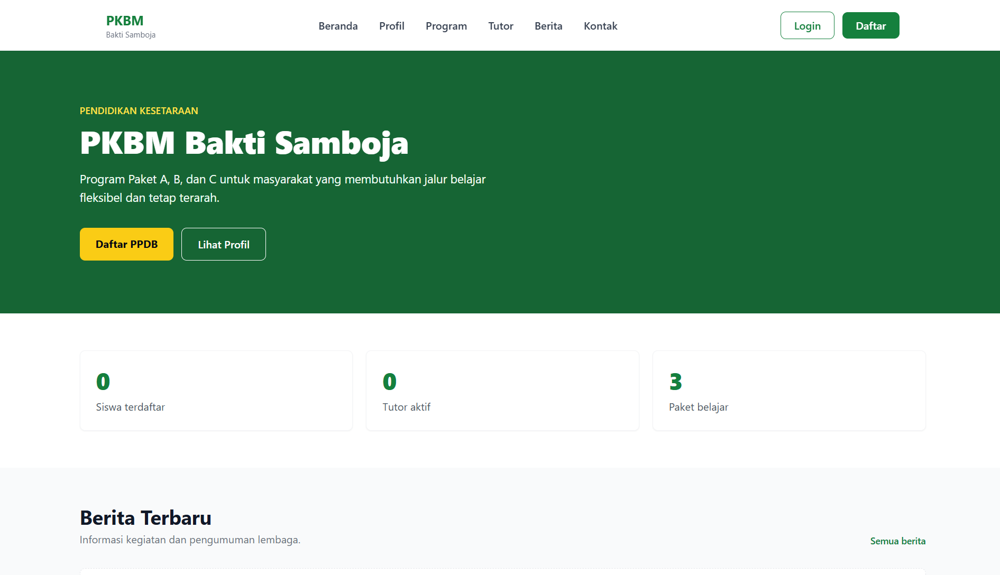
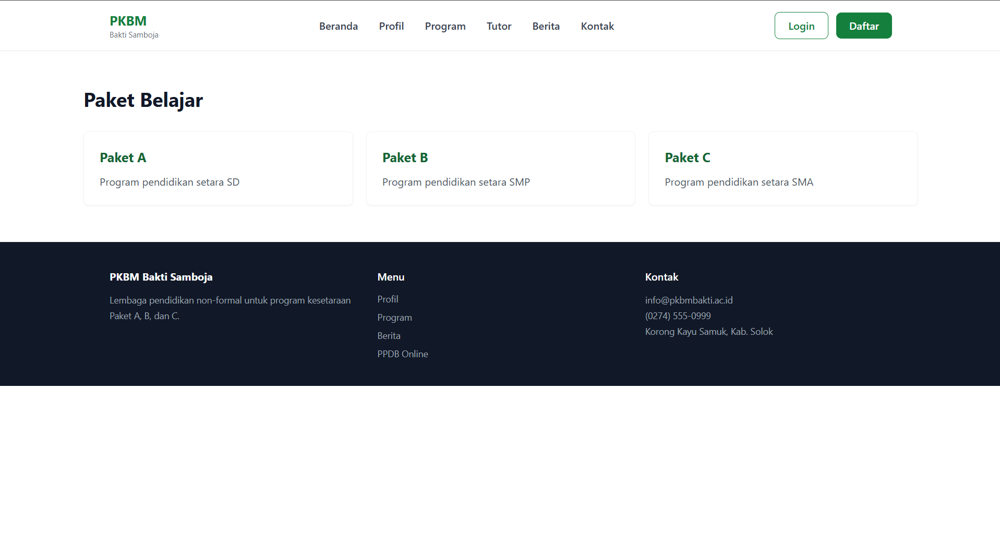
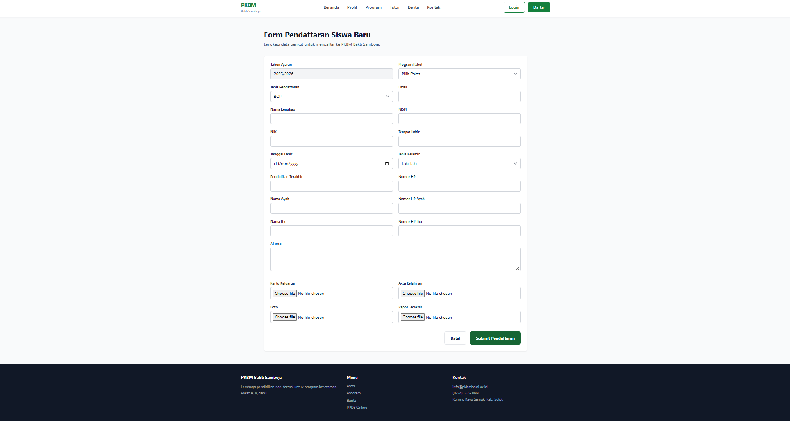
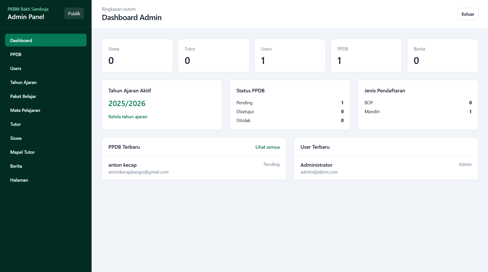

# 1. Dokumentasi Fitur Website PKBM Bakti Samboja

Website PKBM Bakti Samboja melayani tiga aktor utama, yaitu **Admin**, **Tutor**, dan **Siswa**. Seluruh akses sistem dikendalikan menggunakan role, status verifikasi pendaftaran, serta policy authorization.

---

# 2. Ringkasan Fitur

| Fitur           | Aktor               | Tujuan                                              |
| --------------- | ------------------- | --------------------------------------------------- |
| Landing Page    | Pengunjung          | Menampilkan profil dan informasi PKBM               |
| Data Siswa      | Pengunjung          | Menampilkan daftar siswa berdasarkan kategori paket |
| Data Tutor      | Pengunjung          | Menampilkan profil tenaga pendidik                  |
| Detail Berita   | Pengunjung          | Menampilkan isi berita secara lengkap               |
| Login           | Admin, Tutor, Siswa | Autentikasi pengguna                                |
| PPDB            | Calon Siswa         | Pendaftaran peserta didik baru                      |
| Lupa Password   | Pengguna            | Meminta tautan reset password                       |
| Reset Password  | Pengguna            | Mengganti password akun                             |
| Profil Pengguna | Admin, Tutor, Siswa | Mengelola profil dan kredensial                     |
| Panel Admin     | Admin               | Pengelolaan data dan operasional sistem             |
| Panel Tutor     | Tutor               | Pengelolaan nilai siswa                             |
| Panel Siswa     | Siswa               | Akses nilai akademik pribadi                        |

---
# Dashboard

### Tujuan

Menampilkan identitas lembaga, visi misi, konten berita terbaru, dan informasi umum mengenai program kesetaraan.

### Aktor

Pengunjung umum / masyarakat.

### Alur Sistem

1. Pengunjung membuka halaman beranda.
2. Sistem mengambil data berita terbaru.
3. Sistem mengambil data visi dan misi lembaga.
4. Informasi ditampilkan pada halaman utama.



### Route & Kode Terkait

| Komponen   | Lokasi                           |
| ---------- | -------------------------------- |
| Route      | `GET /`                          |
| Controller | `HomeController`                 |
| View       | `resources/views/home.blade.php` |

---

# Data Siswa per Kategori

### Tujuan

Memudahkan publik melihat transparansi daftar siswa aktif berdasarkan kelompok Paket Pendidikan.

### Aktor

Pengunjung umum.

### Alur Sistem

1. Pengunjung membuka halaman data siswa.
2. Sistem melakukan filter berdasarkan kategori paket.
3. Sistem menampilkan data siswa menggunakan pagination.



### Route & Kode Terkait

| Komponen  | Lokasi                                               |
| --------- | ---------------------------------------------------- |
| Route     | `GET /data-siswa`                                    |
| Component | `StudentCatalog`                                     |
| View      | `resources/views/livewire/student-catalog.blade.php` |

### Kategori Paket

| Paket   | Setara |
| ------- | ------ |
| Paket A | SD     |
| Paket B | SMP    |
| Paket C | SMA    |

---

# Data Tutor

### Tujuan

Menampilkan daftar tenaga pendidik aktif beserta kompetensi mata pelajaran yang diampu.

### Aktor

Pengunjung umum.

### Alur Sistem

1. Pengunjung membuka halaman tutor.
2. Sistem mengambil data tutor.
3. Sistem menampilkan nama, foto, dan bidang keahlian tutor.

### Route & Kode Terkait

| Komponen   | Lokasi                                   |
| ---------- | ---------------------------------------- |
| Route      | `GET /tutor`                             |
| Controller | `TutorController@index`                  |
| View       | `resources/views/tutors/index.blade.php` |

---

# Detail Berita

### Tujuan

Menampilkan isi lengkap berita atau artikel kegiatan PKBM.

### Aktor

Pengunjung umum.

### Alur Sistem

1. Pengunjung memilih berita.
2. Sistem melakukan route model binding menggunakan slug.
3. Konten berita ditampilkan secara lengkap.

### Route & Kode Terkait

| Komponen   | Lokasi                                 |
| ---------- | -------------------------------------- |
| Route      | `GET /berita/{post:slug}`              |
| Controller | `PostController@show`                  |
| View       | `resources/views/posts/show.blade.php` |

---

# Login

### Tujuan

Mengautentikasi Admin, Tutor, dan Siswa melalui satu halaman login.

### Aktor

* Admin
* Tutor
* Siswa aktif

### Alur Sistem

1. Pengguna memasukkan email/NISN/NIDN dan password.
2. Sistem memvalidasi akun.
3. Sistem membuat session login.
4. Sistem mengarahkan pengguna sesuai role.

### Redirect Role

| Role  | Redirect |
| ----- | -------- |
| Admin | `/admin` |
| Tutor | `/tutor` |
| Siswa | `/siswa` |

### Route & Kode Terkait

| Komponen   | Lokasi                           |
| ---------- | -------------------------------- |
| Route      | `GET /login`                     |
| Route      | `POST /login`                    |
| Controller | `AuthenticatedSessionController` |
| Request    | `LoginRequest`                   |

---

# PPDB (Pendaftaran Peserta Didik Baru)

### Tujuan

Memungkinkan calon siswa melakukan pendaftaran secara mandiri.

### Aktor

Calon siswa baru.

### Alur Sistem

1. Mengisi data identitas.
2. Memilih tahun ajaran.
3. Memilih kategori jalur masuk.
4. Data disimpan dengan status `pending`.
5. Menunggu verifikasi admin.



### Route & Kode Terkait

| Komponen   | Lokasi                   |
| ---------- | ------------------------ |
| Route      | `GET /ppdb/daftar`       |
| Route      | `POST /ppdb/daftar`      |
| Controller | `RegistrationController` |
| Request    | `RegistrationRequest`    |

### Kategori PPDB

#### Penerima BOP

Jalur bantuan operasional pemerintah dengan kewajiban mengunggah dokumen pendukung seperti KIP atau SKTM.

#### Non BOP (Mandiri)

Jalur reguler dengan pembiayaan mandiri.

---

# Lupa Password

### Tujuan

Mengirimkan tautan reset password ke email pengguna.

### Aktor

Pengguna yang lupa kata sandi.

### Route & Kode Terkait

| Komponen   | Lokasi                        |                        |
| ---------- | ----------------------------- | ---------------------- |
| Route      | `GET                          | POST /forgot-password` |
| Controller | `PasswordResetLinkController` |                        |

---

# Reset Password

### Tujuan

Memperbarui password menggunakan token reset.

### Aktor

Pengguna yang menerima tautan reset.

### Route & Kode Terkait

| Komponen   | Lokasi                        |
| ---------- | ----------------------------- |
| Route      | `GET /reset-password/{token}` |
| Route      | `POST /reset-password`        |
| Controller | `NewPasswordController`       |

---

# Profil Pengguna (Filament)

### Tujuan

Menyediakan pengelolaan profil dan kredensial keamanan secara mandiri.

### Aktor

* Admin
* Tutor
* Siswa

### Batasan Siswa & Tutor

* Hanya dapat mengganti password.
* Data identitas bersifat *read-only*.
* Perubahan data identitas hanya dapat dilakukan Admin.

### Kode Terkait

* `app/Filament/Pages/Auth/CustomEditProfile.php`
* `AdminPanelProvider`
* `TutorPanelProvider`
* `StudentPanelProvider`

---

# Panel Admin

**Path:** `/admin`

### CRUD Konten & Berita

* Resource: `PostResource`
* Path: `/admin/posts`

### CRUD Data Siswa

* Resource: `StudentResource`
* Path: `/admin/students`

### CRUD Data Tutor

* Resource: `TutorResource`
* Path: `/admin/tutors`

### CRUD Verifikasi PPDB

* Resource: `RegistrationVerificationResource`
* Path: `/admin/verifikasi-ppdb`



---

# Panel Tutor

**Path:** `/tutor`

### Modul Input Nilai Siswa

* Resource: `AcademicScoreResource`
* Path: `/tutor/academic-scores`

Tutor dapat memilih kelas Paket, mata pelajaran yang diampu, serta menginput nilai siswa berdasarkan Tahun Ajaran berjalan.

Tutor tidak dapat mengakses data keuangan maupun akun tutor lain.

---

# Panel Siswa

**Path:** `/siswa`

### Fitur yang Tersedia

* Melihat nilai siswa secara privat.
* Mengakses raport digital.
* Mengunduh rekap nilai dalam format dokumen digital.

### Resource

* `MyScoreResource`
* Path: `/siswa/my-scores`

Seluruh data bersifat *read-only* dan hanya dapat diakses oleh siswa yang sedang login.

---

# Authorization & Policy

### Akses Panel

| Role  | Panel   |
| ----- | ------- |
| Admin | `admin` |
| Tutor | `tutor` |
| Siswa | `siswa` |

Implementasi dilakukan melalui:

```php id="5tvj5q"
FilamentUser::canAccessPanel()
```

Akses akan ditolak apabila status pendaftaran masih `pending`.

### 3. Policy yang Tersedia

* Post (Berita)
* Student (Siswa)
* Tutor
* AcademicScore (Nilai)
* Registration (PPDB)
